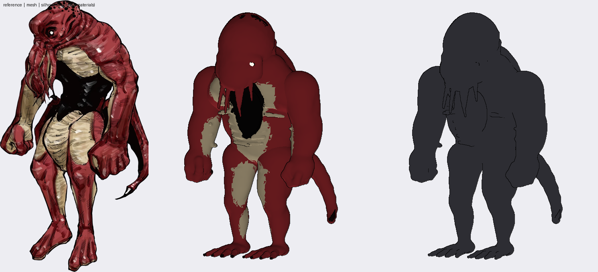
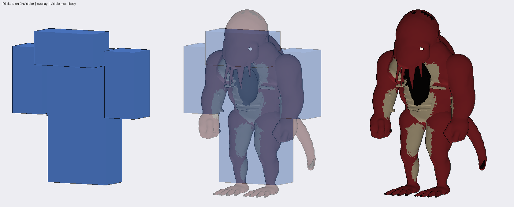
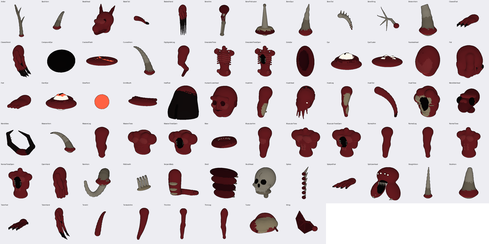

# Curse Body System (Roblox R6)

**R6 skeleton + sculpted organic meshes + modular curse anatomy.**

The R6 rig is an invisible skeleton. It keeps R6 animation, physics and hitboxes
working. Every visible surface is a sculpted MeshPart from a procedurally
modeled mesh library, and one appearance table assembles those parts into a
Curse.



*The reference creature rebuilt from sculpted meshes. Right: the silhouette
alone, with no materials.*



*The R6 skeleton it animates on. You never see it in game.*


*Seven Curses assembled by the framework from the same library, rendered from
the real meshes at the positions the Roblox code places them.*



*The mesh library: 68 sculpted components.*

Design: [docs/ARCHITECTURE.md](docs/ARCHITECTURE.md).

## Install in Studio

1. **Code.** Either:
   - With Rojo: run `rojo serve` (`default.project.json`).
   - Without Rojo: run `python3 tools/pack_rbxmx.py`, then drag `build/CurseBody.rbxmx` into
     ReplicatedStorage, `build/CurseService.rbxmx` into ServerScriptService, and
     `build/CurseClient.rbxmx` into StarterPlayer › StarterPlayerScripts.
2. **Meshes.**
   1. Create a Folder `ReplicatedStorage.CurseAssets`.
   2. Import every `assets/meshes/library/Curse*.obj` with the 3D Importer (File Dimensions: Studs).
   3. Move the imported models into `CurseAssets`.

   Each OBJ holds many named objects (`HuskHead_Skin`, `RamHorn_Bone_L`, …). The
   framework finds MeshParts by name anywhere under that folder and resizes them
   itself.
3. **Avatar.** Set Game Settings → Avatar → Avatar Type to **R6**.
4. **Try it.** Press Play. In Studio a gallery of every preset spawns near the world origin.

If the importer changes the mesh axes (parts show up rotated), set
`CurseBody.Builder.MESH_ROTATION` to the correcting CFrame.

## Use

```lua
local CurseBody = require(game.ReplicatedStorage.CurseBody)

CurseBody.apply(character, {
    BodyType = "Heavy", Palette = "Crimson", Height = 1.2,
    Head = "HuskHead", Horns = { "RamHorns" },
    Torso = "HuskTorso", Arms = { Right = "HuskArm", Left = "BoneArm" }, Hands = "Fist", ExtraArms = 2,
    Legs = "DigitigradeLeg", Feet = "TalonFoot", Tails = { "BoneTail" },
    Eyes = { { id = "EyeCluster", socket = "ChestR" } },
    Disfigurements = { { id = "GrinMouth", socket = "Palm_R", scale = 0.6 } },
    Transformation = "SplitMaw",
}, { grade = "Grade1" })

CurseBody.setForm(character, "Full")          -- the head splits into a maw, the chest opens
CurseBody.equip(character, "Horns", { "Antlers" })
```

To build an NPC from the Command Bar:

```lua
local C = require(game.ReplicatedStorage.CurseBody)
local rig = C.createRig("Husk", CFrame.new(0, 5, 0)); rig.Parent = workspace
C.apply(rig, C.Presets.CrimsonHusk.appearance, { grade = "Grade2" })
```

## Add a body part

1. Sculpt it in `tools/sculpt/library.py`:

   ```python
   @component("HookHorn", "Horns", "Grade3", "surface", sided=True, tags=["horn"], socket="TopR")
   def hook_horn(S, H):
       horn(S, H, length=1.1, thickness=0.12, curve=140, curve_dir=(1, 0.2), tip="Claw")
   ```

2. Bake it: `python3 tools/sculpt/library.py --only HookHorn`.
3. Re-import `assets/meshes/library/CurseHorns.obj` into `CurseAssets`.

It's now equippable, grade-gated, usable in transformations and listed by
`GetCatalog`, with no Luau changes.

## Repository

| Path | |
|---|---|
| `tools/sculpt/` | sculpting engine (`sdf.py`), mesh library (`library.py`), reference creature parts (`husk.py`), baker + previews (`bake.py`) |
| `assets/meshes/library/` | baked library: one OBJ per slot + `Library.json` |
| `src/shared/CurseBody/` | runtime framework; `Meshes/Library.lua` is the generated manifest |
| `src/server/`, `src/client/` | CurseService (profiles, grade checks, forms), CurseClient (sway, extra-limb motion, grow-in) |
| `tests/` | mocked Roblox API, headless tests, renders of what the framework assembles |
| `previews/` | `mesh/`: sculpt previews, `curse/`: framework-assembled Curses + transformations |

## Rebuild and test

```
pip install numpy pillow scipy scikit-image fast-simplification
python3 tools/sculpt/library.py            # re-bake the mesh library (~3 min)
python3 tools/sculpt/bake.py husk          # reference-creature comparison previews
LUAU=/path/to/luau python3 tests/run.py    # framework tests + renders
```

The tests run the real framework code under a mocked Roblox API. They build
every preset, transformation stage and component, plus 40 random Curses, and
check grade gating, caps and incremental rebuilds. They fail on any warning or
on a visible part not attached to the skeleton. The mock checks logic and
placement, not Roblox physics or rendering. The OBJ import, `CurseService` and
`CurseClient` still need a check in Studio.
