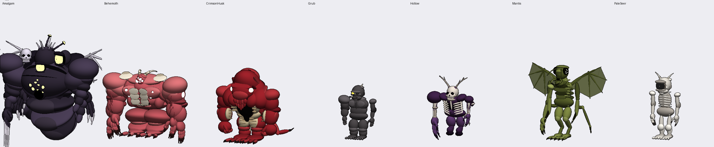

# Curse Body System (Roblox R6)

A modular anatomy framework for player-controlled Curses on the classic **R6** rig.
One appearance table drives heads, horns, eyes, mouths, torsos, arms, hands, legs,
feet, backs, tails, extra limbs, disfigurements, body types, grades and
transformations. The six R6 parts and their Motor6Ds are never replaced, so every
R6 animation keeps working.



*Seven presets, one system: CrimsonHusk (the reference creature), PaleSeer, Behemoth,
Mantis, Grub, Hollow, Amalgam.*

**Design:** see [docs/ARCHITECTURE.md](docs/ARCHITECTURE.md). It covers the R6 rig,
slots, attachment, proportions, horns and disfigurements, extra limbs,
transformations, grades, storage and extension.

## Install

**With Rojo:** `rojo serve` (uses `default.project.json`).

**Without Rojo:** run `python3 tools/pack_rbxmx.py`, then drag the files from `build/` into Studio:

| File | Put it in |
|---|---|
| `build/CurseBody.rbxmx` | `ReplicatedStorage` |
| `build/CurseService.rbxmx` | `ServerScriptService` |
| `build/CurseClient.rbxmx` | `StarterPlayer › StarterPlayerScripts` |

Set **Game Settings → Avatar → Avatar Type = R6**. When you press Play in Studio, a
gallery of every preset spawns in front of the spawn point (`CONFIG.SPAWN_PRESET_GALLERY`).

## Use

```lua
local CurseBody = require(game.ReplicatedStorage.CurseBody)

-- any R6 character or NPC
CurseBody.apply(character, {
    BodyType = "Heavy", Palette = "Crimson", Height = 1.2,
    Head = "OctopoidHead", Horns = { "RamHorns" },
    Eyes = { { id = "Eye", socket = "EyeL" }, { id = "EyeCluster", socket = "ChestR" } },
    Torso = "HunchedTorso", TorsoGrowths = { "ChestCavity" },
    Arms = { Right = "HeavyArm", Left = "ThinArm" }, Hands = "ClawedHand", ExtraArms = 2,
    Legs = "DigitigradeLeg", Feet = "TalonFoot", Tails = { "BoneTail" },
    Disfigurements = { { id = "GrinMouth", socket = "Palm_R", scale = 0.6 } },
    Transformation = "SplitMaw",
}, { grade = "Grade1" })

CurseBody.setForm(character, "Full")        -- transformation stage
CurseBody.equip(character, "Horns", { "Antlers" })
CurseBody.setGrade(character, "SpecialGrade")
```

To build an NPC from the Command Bar:

```lua
local C = require(game.ReplicatedStorage.CurseBody)
local rig = C.createRig("Husk", CFrame.new(0, 5, 0)); rig.Parent = workspace
C.apply(rig, C.Presets.CrimsonHusk.appearance, { grade = "Grade2" })
```

Players' appearances save through `CurseService` (DataStore), which also sanitizes
every request against the player's grade. The client script animates tails,
tendrils and extra limbs, and grows new anatomy in when it's added.

## Add a body part

Drop a table into any module in `src/shared/CurseBody/Catalog/` (or add a new module there):

```lua
R.register({
    id = "SpinalFins", slots = { "Back" }, grade = "Grade2",
    params = { socket = "UpperBack", count = 4 },
    build = function(ctx, p)
        local at = ctx.at
        for i = 1, p.count do
            ctx:triangle(at, { 0, 0, i * 0.3 }, { 0, 0.8, i * 0.3 + 0.2 }, { 0, 0, i * 0.3 + 0.4 }, "Membrane")
        end
    end,
})
```

It shows up in `Registry.list("Back")`, is grade-gated and validated, and works in
transformations with no core changes.

## Repository

| Path | |
|---|---|
| `src/shared/CurseBody/` | framework: `init` (API), `Rig`, `Builder`, `Registry`, `Slots`, `BodyTypes`, `Grades`, `Palettes`, `Appearance`, `Presets` |
| `src/shared/CurseBody/Catalog/` | 138 components and 7 transformations |
| `src/server/`, `src/client/` | runtime scripts |
| `tests/` | mocked Roblox API, headless tests, ray-traced previews |
| `previews/curse/` | renders of every preset and transformation (generated) |
| `roblox/BuildRedCreature.lua` | the original standalone reference creature (Command Bar script) |
| `tools/` | creature generator, `pack_rbxmx.py` |

## Tests

```
pip install numpy pillow        # renders only
LUAU=/path/to/luau python3 tests/run.py
```

Runs the real framework code under a mocked Roblox API (`tests/mock/roblox.luau`).
The run builds every preset and transformation stage, and every component in every
slot it accepts. It checks grade gating, caps, alias migration, incremental rebuilds
and 40 random appearances. It fails on any build warning or on a visible part that
isn't welded to the rig. The previews in `previews/curse/` come from that run.

The mock is not Roblox: it checks logic and geometry placement, not physics,
replication or rendering. `CurseService` and `CurseClient` are compile-checked
only, so check them in Studio.
